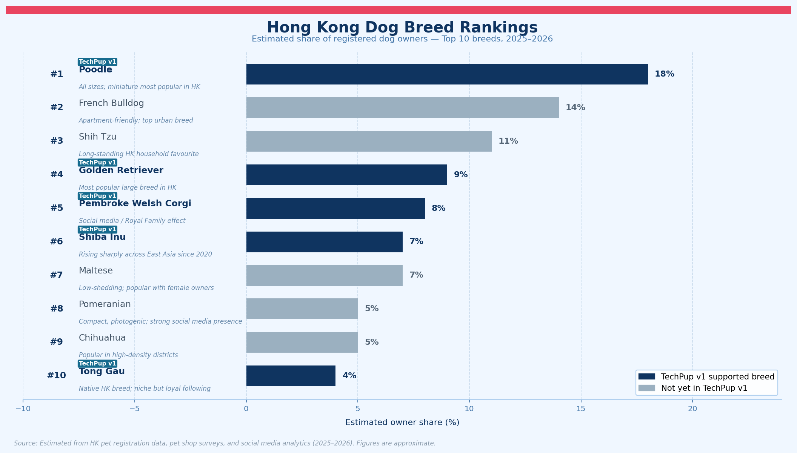

# TechPup — Core Game Loop: Reverse Tamagotchi Blueprint

Design date: 2026-06-22
Builds on: [`competitive-analysis-and-usp.md`](competitive-analysis-and-usp.md)

---

## 1. Reverse Tamagotchi Product Blueprint

### Core Concept
A classic Tamagotchi asks the owner to feed inputs to a fake pet. TechPup reverses this: the dog's **real collar data** (activity, heart rate, weight, sleep, bark events) determines the avatar's mood. The avatar's needs then become **missions the owner completes with the real dog**. The avatar doesn't need imaginary food — it needs the dog to actually go for that walk.

### Why this works where competitors fail

| Competitor failure | TechPup answer |
|---|---|
| FitBark: dashboard with no story, no action | Avatar mood gives the data a face and a daily call to action |
| Woofz: guilt-based billing, cancellation friction | Shame-free missions — even bad moods reward the owner for showing up |
| Zigzag: stage-locked, expires after puppy phase | Loop grows with the dog's entire lifespan, all breeds, all ages |
| Tamagotchi: harsh penalty, no real-world utility | Avatar never "dies" — distressed mood = vet nudge, not game over |
| Pokémon Go: loop decays without fresh content | Multiple reward horizons + social + seasonal quests sustain long-term return |

### Design rules (non-negotiable)
1. **The avatar never dies, never punishes.** Bad data → concerned/distressed mood + vet nudge. Never a game over.
2. **One primary mission per session.** Mirrors Duolingo's "one lesson." Owner always knows the single next action.
3. **Rewards for showing up, not for perfection.** A tired or bored mood still earns coins for completing its mission.
4. **All data reflects the real dog.** Avatar mood is computed from wearable readings — never synthetic timers.
5. **Cosmetics are earned, never locked behind levels.** Any outfit purchasable from day one with PupCoins.

### Core building blocks

| Element | Description | Status |
|---|---|---|
| Avatar mood | 10 mood states derived from `compute_wellness_score` + breed-specific thresholds | Live |
| Daily mission | Breed-specific quest per mood (walk, brain drain, recovery setup) | Live |
| PupCoins | Immediate reward per completed mission | Live |
| XP + Level | Long-term progression, 50 XP per level | Live |
| Streak | Consecutive mission days — resets to 1, not 0, on a miss | Live |
| Badges | Milestone unlocks (3/7/30-day streak, thriving, joint health guardian) | Live |
| Cosmetic shop | PupCoin-based, no level gates, rotating weekly items | Planned |
| Passive coins | Every 2 hrs based on avatar mood (happy = coins, thriving = 2×) | Planned |
| Twice-daily missions | Morning window (06–12) + evening window (17–22) | Planned |
| Login streak bonuses | Day 7 = +100 coins, Day 30 = +500 coins + exclusive badge | Planned |
| Dog social meetings | In-person meeting rated by both owners → coins + Social Skills XP | Planned |
| Training program XP | Completing a lesson awards Training XP + "Good Student" badge | Planned |
| Vet report | PDF/link export of 30-day history for vet appointments | Planned |

---

## 2. User Journey Map

| Stage | Trigger | User action | App response | Emotional beat |
|---|---|---|---|---|
| **1. Morning sync** | Collar syncs overnight sleep + mobility data | Owner wakes up | Wellness score computed silently in background | — |
| **2. Open App** | Push notification: *"Tong Gau's avatar wants to see you"* | Taps notification | Home tab loads: animated avatar + mood + speech bubble | Curiosity — "how did my dog sleep?" |
| **3. Read the mood** | Avatar visible | Reads speech bubble e.g. *"I'm bored… let's do 15 min outside!"* | Mood explanation shown, quick stats chips loaded | Clarity — "I know exactly what to do today" |
| **4. Accept mission** | Mission card displayed | Taps "Start Walk" or reads mission | Mission card shows breed-specific instructions + reward preview | Motivation — "I can do this now" |
| **5. Complete activity with dog** | Owner leaves home with dog | Completes walk / brain drain / recovery as instructed | Collar tracks movement; GPS logs route in Activity tab | Bonding — real time with the dog |
| **6. Log completion** | Returns home | Taps "Complete mission" in morning or evening window | PupCoins + XP awarded, streak incremented, badges checked | Gratification — coin animation, balloon if badge unlocked |
| **7. Evening check-in** | 17:00 window opens | Opens app again, logs evening mission if applicable | +Bonus coins if both windows completed today ("Full day") | Consistency reward |
| **8. Passive coins tick** | 2 hrs elapsed since last open | — | App calculates passive coins based on avatar mood and credits on next open | Surprise — small windfall when opening |
| **9. Level up** | Cumulative XP crosses threshold | — | Avatar level-up animation + new cosmetic/quest unlocked | Pride — "my dog's avatar is growing" |
| **10. Browse shop** | Earned PupCoins | Opens More tab → Cosmetic Shop | Sees new rotating weekly items; buys an outfit | Personalisation — avatar looks like their dog |
| **11. Meet a friend's dog** | Real-world dog park encounter | Both owners scan QR codes, rate interaction (🐾/🐕/❤️) | Coins + Social Skills XP awarded to both; ❤️ triggers fireworks | Social joy |
| **12. Return tomorrow** | Evening notification | Loop restarts at Stage 1 | Fresh collar data → new mood computed | Habit — automatic, like checking messages |

**Key insight:** Stages 1–2 are passive (the collar and server do the work). Stages 3–6 are the active daily loop the owner controls. Stages 7–12 are the retention layer that gives long-term meaning to the daily repetition.

---

## 3. Core Game Loop Diagram

```
  ┌───────────────────────────────────────────────────────────────┐
  │                   RETURN TOMORROW                              │
  │           (new collar data → fresh mood)                       │
  └───────────────────────────┬───────────────────────────────────┘
                               │
                               ▼
              ┌────────────────────────────────┐
              │         OPEN APP               │
              │  Push notification or habit    │
              └───────────────┬────────────────┘
                               │
                               ▼
              ┌────────────────────────────────┐
              │      AVATAR MOOD DISPLAYED      │
              │  Collar data → wellness score   │
              │  → one of 10 moods              │
              │  → speech bubble on avatar      │
              └───────────────┬────────────────┘
                               │
                               ▼
              ┌────────────────────────────────┐
              │       RECEIVE MISSION           │
              │  Breed-specific quest card      │
              │  Morning window: 06:00–12:00    │
              │  Evening window: 17:00–22:00    │
              └───────────────┬────────────────┘
                               │
                               ▼
              ┌────────────────────────────────┐
              │   COMPLETE ACTIVITY WITH DOG    │
              │  Walk / brain drain / rest      │
              │  Collar auto-tracks OR          │
              │  owner taps "Complete"          │
              └───────────────┬────────────────┘
                               │
                               ▼
              ┌────────────────────────────────┐
              │        EARN REWARDS             │
              │  PupCoins (mood-based)          │
              │  XP (wellness score ÷ 10)       │
              │  Streak increment               │
              │  Passive coins (2-hr ticks)     │
              │  +Bonus if both windows done    │
              └───────────────┬────────────────┘
                               │
                     ┌─────────┴──────────┐
                     │                    │
                     ▼                    ▼
          ┌──────────────────┐  ┌──────────────────────┐
          │   LEVEL UP?       │  │   BADGE / MILESTONE? │
          │ XP ≥ threshold    │  │ Streak 3/7/30, first │
          │ → cosmetic unlock │  │ thriving, social, etc│
          └────────┬─────────┘  └──────────┬───────────┘
                   │                        │
                   └──────────┬─────────────┘
                               │
                               ▼
              ┌────────────────────────────────┐
              │    UNLOCK NEW CHALLENGE         │
              │  New quest variant              │
              │  New cosmetic in shop           │
              │  Seasonal event quest           │
              │  Dog social interaction         │
              └───────────────┬────────────────┘
                               │
                               └──► RETURN TOMORROW
```

**What makes this "reverse":** The loop's energy source is real dog behaviour captured by the collar — not a tap on a virtual food button. The avatar's next mood is only as good as what actually happened with the dog today.

---

## 4. Reward System Proposal

### 4.1 PupCoins — Immediate Reward

**Earning sources:**

| Source | Coins | Notes |
|---|---|---|
| Morning mission complete (06–12) | 2–20 (mood-based) | See table below |
| Evening mission complete (17–22) | 2–20 (mood-based) | Second window per day |
| Both windows completed same day | +5 bonus | "Full day" consistency bonus |
| Passive tick — avatar is `happy` (per 2 hrs) | 3–5 | Calculated on next app open |
| Passive tick — avatar is `thriving` (per 2 hrs) | 6–10 | 2× multiplier |
| Day 7 login streak | +100 | Large milestone haul |
| Day 30 login streak | +500 | Major haul + exclusive badge + cosmetic |
| Dog social — Friends (🐕) | +50 | Both owners receive |
| Dog social — Love (❤️) | +250 | Both owners + fireworks animation |
| Training lesson completed | +10 | Per lesson, any program |

**Mission coins by mood:**

| Mood | Coins per completion |
|---|---|
| Thriving | 20 |
| Happy | 10 |
| Content | 8 |
| Bored / Tired / Anxious | 5 |
| Uneasy / Overtired | 2–3 |
| Concerned / Distressed | 0 |

**Spending:** Cosmetic shop only. No gameplay advantages purchasable. Shop rotates weekly so there is always something new to save toward.

---

### 4.2 XP & Levels — Long-Term Progression

- XP per mission completion = `overall_score ÷ 10` (e.g. score 85 → 8.5 XP)
- XP also from: training lessons (+15 per lesson), social interactions (+5/+20)
- 50 XP per level (flat curve for now, adjustable)
- **Leveling never regresses** — a bad week slows growth, never demotes the avatar
- Levels do not gate cosmetics — they gate new quest variants and bonus event access

---

### 4.3 Streaks — Habit Reinforcement

Two separate streak counters:

| Streak type | What resets it | Milestone bonuses |
|---|---|---|
| **Mission streak** | No mission completed all day | Badges at 3, 7, 30 days |
| **Login streak** | App not opened all day | +100 coins day 7, +500 coins day 30 |

- Missing a mission streak resets to 1 (not 0) — the next action still counts
- Login streak is independent — owner can keep login streak alive even on rest days

---

### 4.4 Badges — Milestone Recognition

| Badge | Trigger |
|---|---|
| 🐾 First Steps | Complete first mission |
| 🔥 3-Day Streak | Mission streak ≥ 3 |
| 🔥 7-Day Streak | Mission streak ≥ 7 |
| 🔥 30-Day Streak | Mission streak ≥ 30 |
| 🤩 Thriving | First `thriving` mood reading |
| 🛡️ Joint Health Guardian | Recover from `concerned`/`distressed` to a good mood |
| 🎓 Good Student | Complete a full training program |
| ❤️ Love at First Sight | First `Love` dog social interaction |
| 📅 Day 7 | 7-day login streak |
| 🏆 Day 30 | 30-day login streak + exclusive cosmetic |

---

### 4.5 Unlockable Content — Prevents Loop Decay

The main reason Pokémon Go's revenue halved after 2020 is content stagnation — the loop stayed the same. TechPup counters this with three content channels:

- **New quest variants per level:** e.g. Level 5 Shiba Inu unlocks "advanced scent-trail" brain-drain quests. Keeps missions from feeling repetitive.
- **Seasonal events:** time-limited missions (e.g. "HK Lunar New Year Walk Week", "Summer Hydration Challenge") that replace the default quest for a week. Creates FOMO urgency on a predictable calendar.
- **Breed expansion:** each new breed added to the app is a new content unlock for owners of that breed — new quest copy, new avatar illustrations, new breed-specific badges.

---

### 4.6 Dog Social — Interaction Reward

Real-world dog meetings become in-app events rated by both owners:

| Outcome | Icon | Coins | XP | Extra |
|---|---|---|---|---|
| Growled / went separate ways | 🐾 | 0 | +1 Social Skills XP | Social history still recorded |
| Friends | 🐕 | +50 | +5 | Added to friend list |
| Love | ❤️ | +250 | +20 | Fireworks animation on both screens |

- Both owners must confirm — prevents solo farming
- Friend list shows friend dogs' current avatar mood (not raw health data)
- Friends can send one "Paw" reaction per day (+2 coins to recipient)

---

### 4.7 Vet-Flagged Moods — The Reward Floor

`concerned` and `distressed` moods pay 0 PupCoins and pause passive coin ticks. This is intentional and must not be changed. When a real health signal fires, the game steps aside — a vet nudge must never compete with a reward animation for the owner's attention.

---

## 5. Success Outcome

**The framework that brings users back daily:**

| Reward horizon | Mechanic | Frequency |
|---|---|---|
| Immediate | PupCoins per mission, passive ticks | Every session (up to 2×/day) |
| Short-term | Streak counter, badge unlocks | Daily / every few days |
| Mid-term | XP levels, new quest variants | Weekly |
| Long-term | Login streak milestones, seasonal events, breed expansion | Monthly |

Every morning, fresh collar data produces a new avatar mood. That mood becomes one clear mission. Completing it with the real dog feeds back into tomorrow's data — closing the loop. PupCoins reward the action immediately. XP and levels reward consistency over weeks. Streaks, login bonuses, and social interactions reward consistency over months. Three reward horizons stacked on the same single daily action, so there is always a reason to open the app today and a reason to come back tomorrow.

> *"One mood. One mission. One walk. Every day — and your dog's avatar (and your dog) both get a little better for it."*

---

## 6. HK Breed Market — Popularity & TechPup Coverage

The chart below shows the top 10 breeds by estimated owner share in Hong Kong (2025–2026). Navy bars are breeds already supported in TechPup v1; grey bars are expansion targets for v2+.



**Coverage read:** TechPup v1 covers 5 of the top 10 breeds (Poodle #1, Golden Retriever #4, Corgi #5, Shiba Inu #6, Tong Gau #10), representing an estimated **46% of HK dog owners** combined. The three largest untapped segments — French Bulldog (#2, 14%), Shih Tzu (#3, 11%), and Maltese (#7, 7%) — are the priority targets for v2 breed expansion.

---

## 7. Social Competition System — Owner vs Owner Rankings

### 7.1 Why Add Competition?

The individual game loop (mood → mission → coins → level) drives daily habit. Competition adds a second pull: **other people's dogs make yours feel slow**. A leaderboard seen once a week is enough to push a skipped evening mission into a completed one.

Design rules for competition:
1. **Never punish low performers publicly.** Rankings show top dogs, not a shame ladder.
2. **Competition is always opt-in.** A dog profile is private by default.
3. **Breed-fair by default.** No Chihuahua competes against a Golden Retriever on steps.
4. **Multiple axes.** One dog can be #1 in Likes but #12 in Level — giving every owner a lane.

---

### 7.2 Dog Public Profile

When an owner makes their dog's profile public, it becomes a shareable page other users can visit, follow, and interact with.

| Field | Visible to followers | Notes |
|---|---|---|
| Dog name + breed | ✅ | |
| Avatar (current mood) | ✅ | Updates daily, no raw biometric data |
| Level | ✅ | Computed from cumulative XP |
| Weekly Wellness Score | ✅ | Breed-normalised 0–100 |
| Follower count | ✅ | |
| Weekly Paws (likes) received | ✅ | |
| Mission streak | ✅ | |
| Badges earned | ✅ | |
| Raw health data (HR, weight, sleep) | ❌ | Never exposed publicly |

---

### 7.3 Four Competition Axes

| Axis | What it measures | Reset cycle | Scope |
|---|---|---|---|
| **Level** | Total XP earned since registration | Never (permanent) | Global + same breed |
| **Weekly Wellness Score** | Average daily wellness score over the past 7 days | Every Monday 00:00 | Same breed only |
| **Followers** | Total follower count | Never (permanent) | Global |
| **Weekly Paws (Likes)** | Paw reactions received from followers in the past 7 days | Every Monday 00:00 | Global |

Each axis has its own leaderboard. One dog can rank in multiple — or just one. This prevents a single mega-active dog from dominating every category.

---

### 7.4 Leaderboard Structure

```
+-----------------------------------------------------------+
|  LEADERBOARDS                       [ This Week ]         |
+-----------------------------------------------------------+
|  [ By Level ]  [ Wellness Score ]  [ Followers ]  [ Paws ]|
+-----------------------------------------------------------+
|  BREED FILTER: [ All ] [ Poodle ] [ Golden Retriever ]... |
+-----------------------------------------------------------+

  BY LEVEL — Global Top 10 (this week)
  ┌────┬──────────────────────┬──────┬───────┬──────────┐
  │ #  │ Dog                  │ Lvl  │ Breed │ Followers│
  ├────┼──────────────────────┼──────┼───────┼──────────┤
  │ 1  │ 🤩 Mochi             │  47  │ Corgi │   1,204  │
  │ 2  │ 🙂 Butter            │  44  │ Poodle│     987  │
  │ 3  │ 😌 Shadow            │  41  │ Shiba │     743  │
  │ …  │ …                    │  …   │ …     │     …    │
  │ ?  │ [Your dog rank here] │  12  │ Corgi │      34  │
  └────┴──────────────────────┴──────┴───────┴──────────┘
                              [ View your breed only ]
```

**Your position** is always shown at the bottom of any leaderboard, even if outside the top 10.

---

### 7.5 Paw Reactions (Likes System)

Followers send a **Paw** (🐾) reaction to a dog's daily mood update. This is the "like" of the TechPup social layer.

| Rule | Detail |
|---|---|
| How to send | Tap 🐾 on any public dog's daily update card |
| Limit | 5 Paws per user per day (prevents farming) |
| Reward to recipient | +2 PupCoins per Paw received |
| Weekly Paws leaderboard | Top 10 most-Pawed dogs this week, globally |
| Milestone badge | "Fan Favourite" — awarded at 100 Paws in a single week |

**What triggers a daily update card** (the thing followers can Paw):
- Avatar mood change (morning sync)
- Mission completed
- Badge unlocked
- Level-up
- New "Love" social meeting

---

### 7.6 Follower System

| Action | How |
|---|---|
| Follow a dog | Tap Follow on any public profile |
| Unfollow | Tap again, no notification sent |
| Follower feed | Home tab "Community" sub-section shows today's updates from followed dogs |
| Follower milestones | 10 followers → "Rising Star" badge; 100 → "Local Legend"; 500 → "HK Icon" |
| Follower count leaderboard | Global Top 10 most-followed dogs (reset: never) |

Follower counts are **permanent** — they do not reset weekly. This rewards sustained community engagement over time, separate from the weekly activity-based rankings.

---

### 7.7 Competition Loop Diagram

```
        ┌──────────────────────────────────────────────────┐
        │              OWNER OPENS APP DAILY               │
        └─────────────────────┬────────────────────────────┘
                              │
                              ▼
        ┌──────────────────────────────────────────────────┐
        │         COMPLETES MISSION / EARNS XP             │
        │   XP → Level  │  Score → Wellness Leaderboard    │
        └──────┬─────────────────────────┬─────────────────┘
               │                         │
               ▼                         ▼
  ┌────────────────────┐    ┌──────────────────────────┐
  │  LEVEL LEADERBOARD │    │  WELLNESS LEADERBOARD    │
  │  Global ranking    │    │  Same-breed only         │
  │  by cumulative XP  │    │  Resets every Monday     │
  └────────────────────┘    └──────────────────────────┘
               │                         │
               └────────────┬────────────┘
                            │
                            ▼
        ┌──────────────────────────────────────────────────┐
        │         DAILY UPDATE POSTED TO FOLLOWERS         │
        │  Mood card / badge unlock / level-up / meeting   │
        └──────────────────┬───────────────────────────────┘
                           │
               ┌───────────┴───────────┐
               ▼                       ▼
  ┌─────────────────────┐   ┌──────────────────────────┐
  │  FOLLOWERS PAW IT   │   │  NEW USERS DISCOVER DOG  │
  │  +2 coins/Paw       │   │  → Follow → more Paws    │
  │  Weekly Paws rank   │   │  → Follower leaderboard  │
  └──────────┬──────────┘   └──────────┬───────────────┘
             │                         │
             └────────────┬────────────┘
                          │
                          ▼
        ┌──────────────────────────────────────────────────┐
        │           MILESTONE BADGES UNLOCK                │
        │  Fan Favourite / Rising Star / HK Icon           │
        │  → Shown on public profile → attracts more       │
        │    followers → closes the social flywheel        │
        └──────────────────┬───────────────────────────────┘
                           │
                           ▼
        ┌──────────────────────────────────────────────────┐
        │         OWNER RETURNS TOMORROW                   │
        │  Checking rank = extra motivation to not miss    │
        │  a mission or a follower's Paw                   │
        └──────────────────────────────────────────────────┘
```

---

### 7.8 Competition Badges

| Badge | Trigger |
|---|---|
| 🏅 Top of the Pack | Reach #1 on any leaderboard for 1 week |
| ⭐ Rising Star | Hit 10 followers |
| 🌟 Local Legend | Hit 100 followers |
| 🏆 HK Icon | Hit 500 followers |
| 🐾 Fan Favourite | Receive 100 Paws in a single week |
| 👑 Level King | Reach top 3 on the Level leaderboard (any breed filter) |
| 🔥 Wellness Champion | #1 Wellness Score in your breed for 2 consecutive weeks |

---

### 7.9 Anti-Gaming Rules

| Risk | Rule |
|---|---|
| Fake followers (self-follow rings) | Follow requires a registered account; accounts with 0 own dogs cannot follow |
| Paw farming between alts | 5 Paws per user per day, hard server-side limit |
| Solo social meeting XP farming | Both owners must verify the same outcome (existing rule) |
| Level sandbagging | Level is cumulative only — no reset, no manipulation |
| Score manipulation | Wellness score is computed server-side from collar data only; no manual override |
